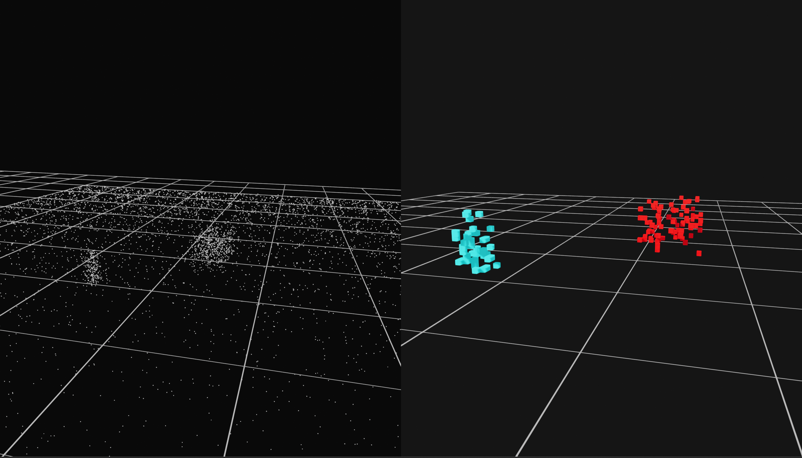

# FPGA-Based LiDAR Processing Accelerator

The main goal of the project is to demonstrate how common LiDAR processing steps can be mapped to a **simple, modular hardware pipeline**, suitable for FPGA implementation and experimentation.

---

## Key Features

### 1. RTL-Level Hardware Simulation

* Bit-accurate modeling of hardware behavior using **PyMTL3**.
* Modular design including:

  * **Voxelization** (spatial discretization)
  * **Floor removal** based on a configurable height threshold
  * **Distance-based clustering** using fixed centroids
* All computations are performed using **integer / fixed-point representations**, similar to real FPGA designs.

### 2. Advanced Visualization (GUI)

* **Split View Interface**:

  * **Left panel:** Raw LiDAR point cloud
  * **Right panel:** Hardware-processed voxel output
* **Volumetric Rendering**:

  * Processed points are displayed as voxels (3D cubes) for better spatial understanding.
* **Color Coding**:

  * Different clusters are shown using distinct colors.

### 3. Flexible Data Pipeline

* Supports:

  * Real LiDAR scans in **KITTI `.bin` format**
  * **Synthetic scenes** (ground + car + pedestrian/pole) for fast testing
* Automatic unit conversion:

  * Floating-point meters → integer fixed-point values for hardware

---

## System Architecture

The overall dataflow through the system is shown below:

1. **Data Ingestion**

   * LiDAR points `(x, y, z)` are loaded from file or generated synthetically.
   * Coordinates are scaled and offset to fit an unsigned fixed-point representation.

2. **Hardware Processing (PyMTL3)**

   * **Voxelizer:**

     * Maps continuous coordinates to a discrete 3D grid using bit shifts.
   * **Floor Filter:**

     * Removes points below a configurable Z threshold (road surface).
   * **Clustering Engine:**

     * Computes squared Euclidean distances to two predefined centroids.
     * Assigns each voxel to the closest cluster.

3. **Visualization (Open3D)**

   * Valid output voxels are converted back to floating-point coordinates.
   * Results are rendered in real time alongside the raw input data.

---

## Installation

The project requires **Python 3.8 or newer**.

1. **Clone the repository:**

   ```bash
   git clone https://github.com/user/lidar-accelerator.git
   cd lidar-accelerator
   ```

2. **Install dependencies:**
   It is recommended to use a virtual environment (`venv` or `conda`).

   ```bash
   pip install -r requirements.txt
   ```

---

## Usage

To run the hardware simulation together with the graphical interface:

```bash
python main.py
```

After launching:



* The **left window** displays the raw LiDAR point cloud.
* The **right window** displays the voxelized and clustered output generated by the hardware model.

Generating Verilog for FPGA

Uncomment the Verilog Translation block:
```bash
# dut.set_metadata( VerilogTranslationPass.enable, True )
# dut.apply( VerilogTranslationPass() )
```
Run the script again. A file named LidarCore.v will be generated.

This file can be imported directly into Vivado for synthesis and bitstream generation.

---

## Notes

* The design is intentionally kept **simple and modular** to make it easy to understand and extend.
* The clustering logic uses a fixed number of centroids (K = 2), but the architecture can be expanded.

---

## Possible Extensions

* Pipelined multi-cycle hardware implementation
* Dynamic centroid update (online K-means)
* Integration with real-time LiDAR streams
* Synthesis-oriented optimizations for FPGA targets
